# Flowers102-Resnet50

FellowshipAi project 

might takes some time to load, due to many plots and gifs, please be patient

The Notebook has everything from downloading dataset to fine tuning the model and inference.

## Preprocessing
- [download.py](engine/data_download.py)
- [data_processing.py](engine/data_processing.py)
### Dataset
- [Flowers102](https://www.robots.ox.ac.uk/~vgg/data/flowers/102/index.html)

### Augmentation
- RandomResizedCrop
- RandomHorizontalFlip
- RandomVerticalFlip
- randomRotation
- CenterCrop

## Trnasformations
  - resize = 224
  - ToTensor
  - Normalize
    - mean = [0.485, 0.456, 0.406]
    - std = [0.229, 0.224, 0.225]

## Model 
- [model.py](engine/model.py)
### Architecture
- Resnet50 - backbone
- MlpHead - head
  - 3 layers
    - 2048 -> 512 -> 102 hidden units
    - ReLU activation
    - Dropout 0.5
    - BatchNorm
    - 
### Train 
  - CrossEntropyLoss
  - Adam optimizer
    - 0.01 learning rate
  - 30 epochs

### Fine-Tuning
  - CrossEntropyLoss
  - Radam optimizer
    - 3e-4 learning rate
  - Cyclical Learning Rates
    - min_lr = 5e-8
    - max_lr = 3e-3
    - mode = 'triangular'
  - 120 epochs

## Results 

### 1. EDA 
#### Classest Distribution
- Class imbalance is present in the dataset

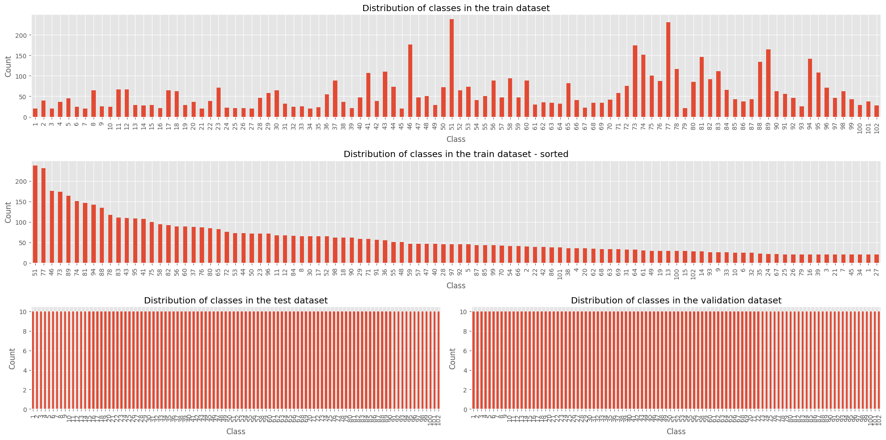

#### Sample Images

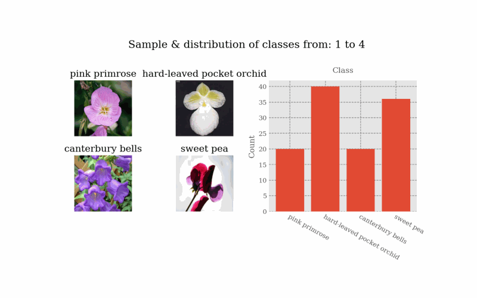

### Training History

##### Highest Accuracy
- Test-Set
  
| Experiment | Accuracy | Loss |
| :---: | :---: | :---: |
| Resnet50 - 30 Epochs | 85.0838% | 0.549521 |
| Resnet50 - 120 Epochs | 89.2956% | 0.386665 |

- Validation-Set

| Experiment | Accuracy | Loss |
| :---: | :---: | :---: |
| Resnet50 - 30 Epochs | 87.2511% | 0.451927 |
| Resnet50 - 120 Epochs | 91.0849% | 0.312610 |

- Train-Set

| Experiment | Accuracy | Loss |
| :---: | :---: | :---: |
| Resnet50 - 30 Epochs | 88.8839% | 0.389938 |
| Resnet50 - 120 Epochs | 96.7953% | 0.105484 |

### Graphs
##### LOSS 
- 30 epochs
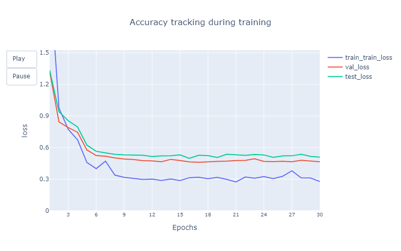
- 120 epochs (fine tuning)
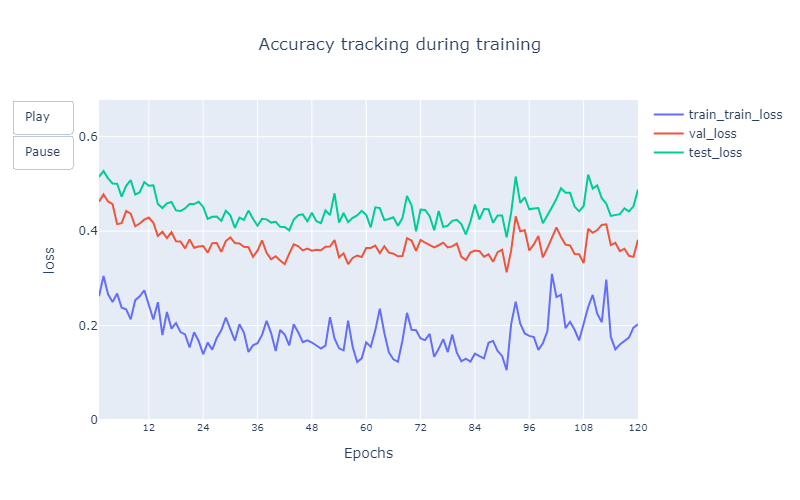

##### ACCURACY
- 30 epochs
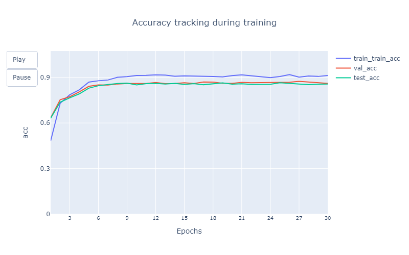
- 120 epochs (fine tuning)
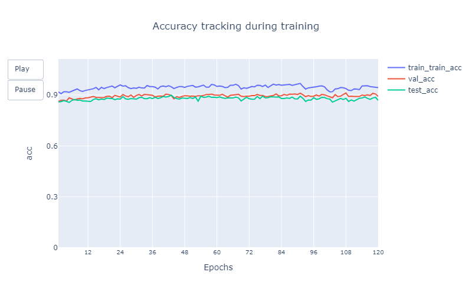

### GradCam
#### Train Sample 
- grad camp for 1 image & top 4 classes

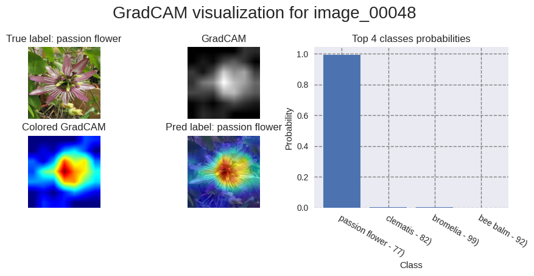

- CAM for all classes

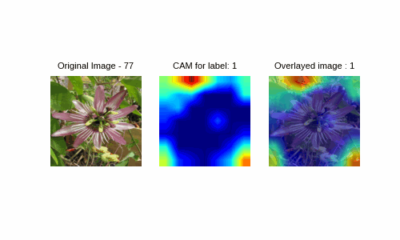

#### Val Sample 
- idx 75
- grad camp for 1 image & top 4 classes

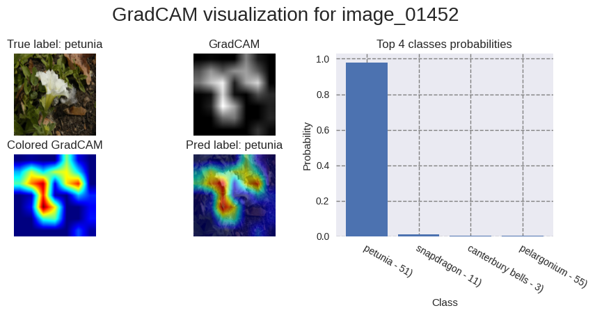

- CAM for all classes

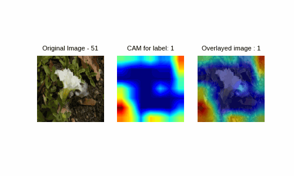

#### Test Sample 
- idx 75
- grad camp for 1 image & top 4 classes

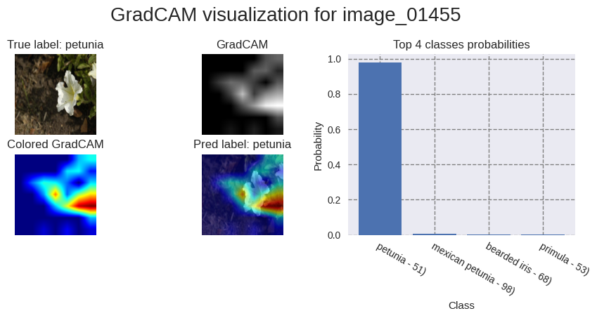

- CAM for all classes

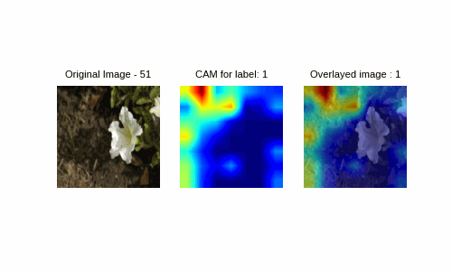

## [Workflow](workflow.md)